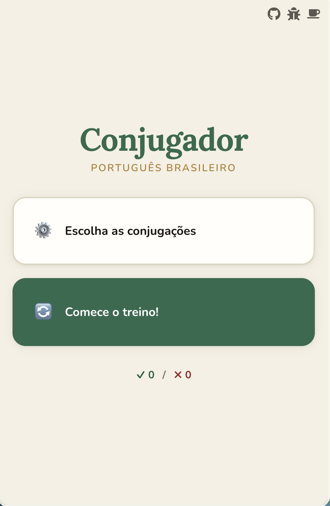
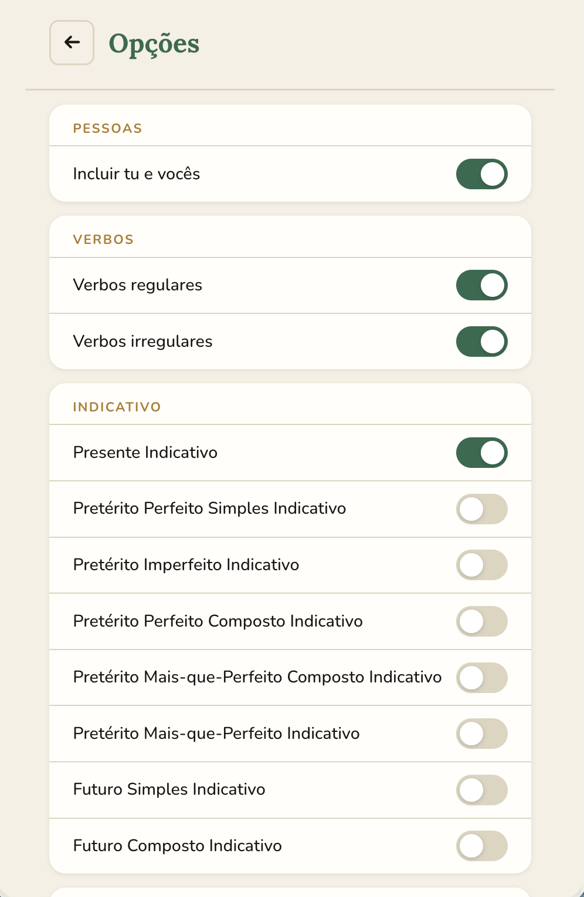
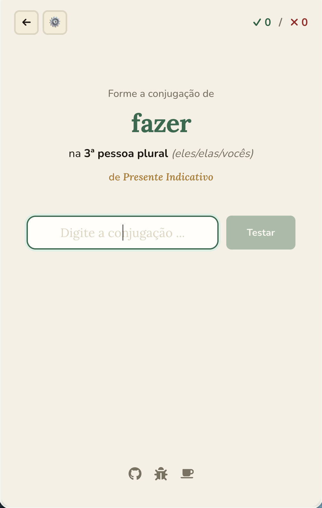
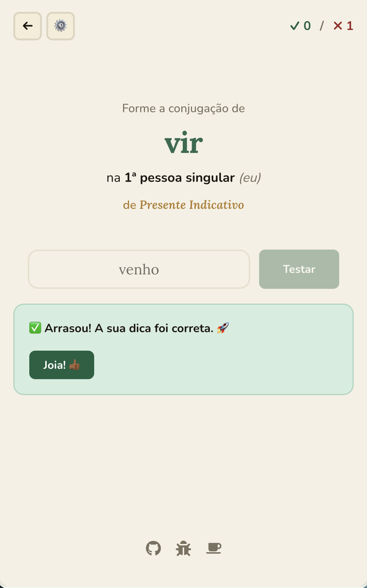
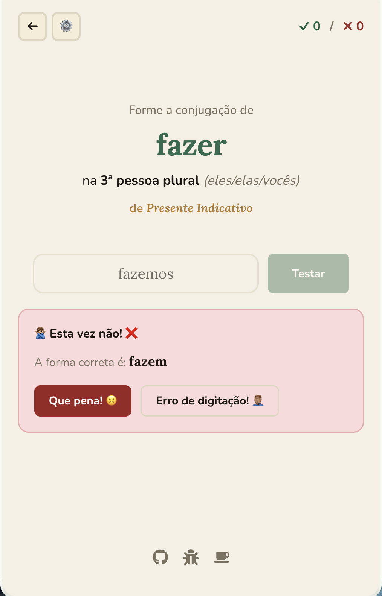

# Portuguese Conjugation 🇧🇷

This is an application to learn basic portuguese conjugation (brazilian variant). You can find the app online at [vercel](https://conjugador-portugues.vercel.app/). The code is licensed with CC-BY-NC-SA 4.0 (see `license` file). If you want to add or support the development, just open an issue or merge request. 

If you like this app, you can [buy me a coffee](https://buymeacoffee.com/philkleer).

## Examples
Here you can see examples (Version: 1.0) of the screens:

  

   

## Available conjugations

# Tempos Verbais

| Indicativo                  | Subjuntivo                  | Condicional                                   |
|-----------------------------|-----------------------------|-----------------------------------------------|
| Presente                    | Presente                    | Futuro do Pretérito Simples (Condicional I)   |
| Pretérito Perfeito Simples  | Pretérito Perfeito Simples  | Futuro do Pretérito Composto (Condicional II) |
| Pretérito Imperfeito        | Pretérito Imperfeito        |                                               |
| Pretérito Perfeito Composto | Pretérito Mais-Que-Perfeito |                                               |
| Pretérito Mais-que-Perfeito | Futuro Simples              |                                               |
| Futuro Simples              | Futuro Composto             |                                               |
| Futuro Composto             |                             |                                               |

## Available verbs

# Verbos

| Verbos -ar | Verbos -er | Verbos -ir | Verbos irregulares |
|------------|------------|------------|--------------------|
| acordar    | aprender   | abrir      | cair               |
| comprar    | acontecer  | assistir   | dizer              |
| cuidar     | bater      | decidir    | estar              |
| detestar   | beber      | desistir   | ir                 |
| deitar     | comer      | discutir   | fazer              |
| falar      | conhecer   | dividir    | passear            |
| gostar     | correr     | dormir     | perder             |
| levar      | encher     | existir    | poder              |
| limpar     | entender   | insistir   | pôr                |
| melhorar   | escolher   | mentir     | querer             |
| pagar      | escrever   | partir     | saber              |
| pensar     | ler        | permitir   | sair               |
| procurar   | receber    | proibir    | sortear            |
| significar | responder  | sentir     | ser                |
| tornar     | vender     | servir     | trazer             |
|            |            |            | ter                |
|            |            |            | ver                |
|            |            |            | vir                |

## Tu e vocês

You can trigger a toggle to also learn the conjugation of *tu* and *vocês*. 

## Want to help on this app? Or you have ideas?

Just make a branch of your own and create a [pull request](https://github.com/philkleer/portuguese-conjugation-react/pulls). If you have just ideas, create an [issue](https://github.com/philkleer/portuguese-conjugation-react/issues). I cannot guarantee that I have time to implement everything, since this is just a hobby.